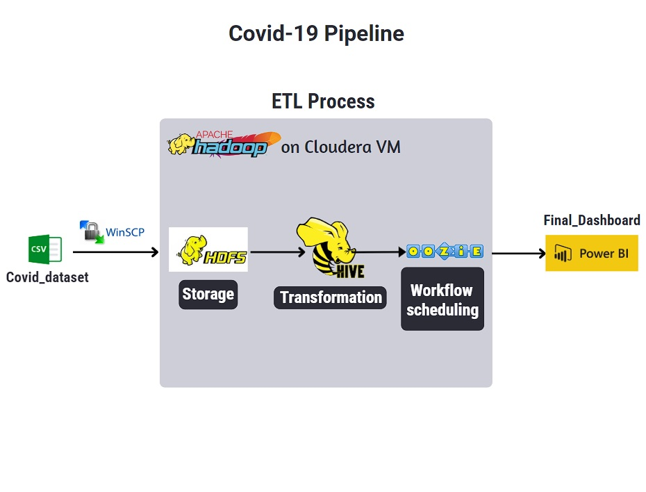

# COVID-19 Analysis (August-2020)

## Introduction

The goal of this project is to perform data analytics on Covid-19(August-2020) data using various tools and technologies, including Cloudera VM, HDFS, Hive, SQL(HQL), Apache Oozie, and Power Bi.

## Architecture 


## Technology Used
- Shell scripting
- SQL (HQL)
- Hadoop
- Power Bi

## Dataset Used
COVID-19 Dataset:
This dataset includes the whole globe's countries COVID-19 info for August-2020, comprises total tests,cases, and deaths for each individual country.

Link: https://github.com/3adiola/Data-Engineering/blob/main/6-%20Covid-19%20analysis/Dataset/covid-19%20dataset.csv

## Challenges
1- In Hive, before excuting the creation of the schema in (covid_data_preparation.hql), we have to set dynamic partitions and increase the number of those partitions by excuting the statements below:
```
set hive.exec.dynamic.partition=true;
SET hive.exec.boolean.evaluation=nonstrict;
set hive.exec.dynamic.partition.mode=nonstrict;
SET hive.exec.max.dynamic.partitions=100000;
SET hive.exec.max.dynamic.partitions.pernode=100000;
```
2- Agian, in Hive, before excuting the creation of the schema, we have to make sure that the delimiter is '\' not a 'comma':
```
ROW FORMAT DELIMITED FIELDS TERMINATED by '\'
```
Because if you set it to a 'comma' the whole data will appear in the first column and all the other columns is going to be all NULLS
